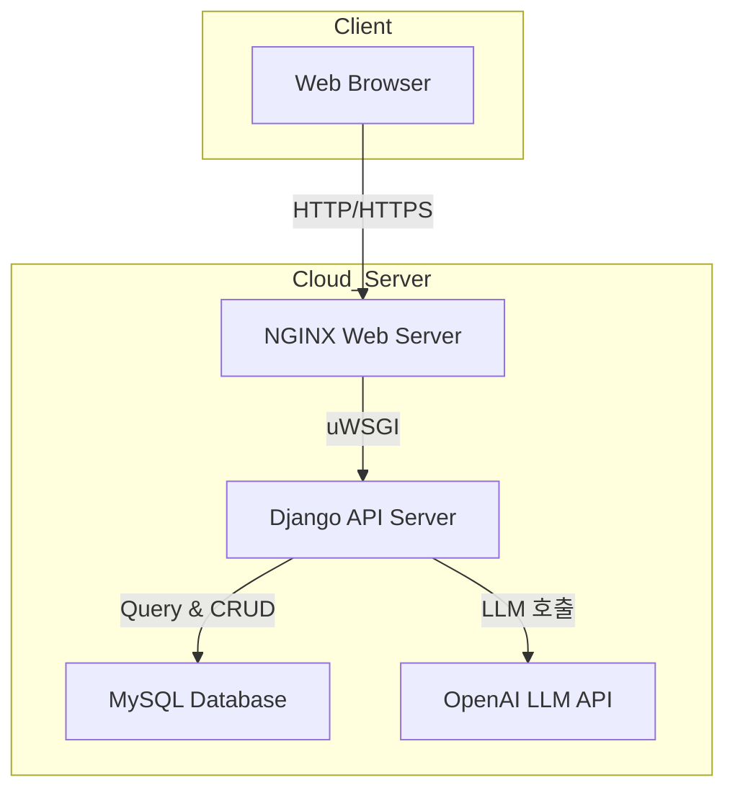

# 📚 SKKU LLM-DDP 프로젝트

이 프로젝트는 Django 기반으로 구축된 **LLM API 서버**로, 클라이언트 요청에 따라 SQL 쿼리를 생성하고 실행하며, 결과를 제공하는 API 서버입니다.



---

## 🚧 프로젝트 구조

```
ddp-api/
├── test.py
├── manage.py
│
├── app/
│   ├── __init__.py
│   ├── asgi.py
│   ├── wsgi.py
│   ├── urls.py
│   ├── settings.py
│   └── renderers.py
│
├── ddp/
│   ├── __init__.py
│   ├── models.py
│   ├── serializers.py
│   ├── apps.py
│   ├── admin.py
│   ├── tests.py
│   ├── urls.py
│   │
│   ├── migrations/
│   │   ├── __init__.py
│   │   ├── 0001_initial.py
│   │   ├── 0002_alter_column_foreign_key_table.py
│   │   ├── 0003_alter_column_data_type.py
│   │   └── 0004_alter_column_description.py
│   │
│   ├── services/
│   │   ├── __init__.py
│   │   ├── database_service.py
│   │   ├── meta_service.py
│   │   └── table_service.py
│   │
│   ├── utils/
│   │   ├── __init__.py
│   │   └── mysql_connector.py
│   │
│   └── views/
│       ├── __init__.py
│       ├── database_view.py
│       ├── column_view.py
│       ├── meta_view.py
│       └── table_view.py
│
├── llm/
│   ├── __init__.py
│   ├── models.py
│   ├── serializers.py
│   ├── apps.py
│   ├── admin.py
│   ├── tests.py
│   ├── urls.py
│   │
│   ├── migrations/
│   │   ├── __init__.py
│   │   ├── 0001_initial.py
│   │   ├── 0002_remove_llmlog_finish_reason_and_more.py
│   │   ├── 0003_queryexecutionlog.py
│   │   ├── 0004_llmlog_agent.py
│   │   ├── 0005_alter_llmlog_table.py
│   │   └── 0006_alter_queryexecutionlog_table.py
│   │
│   ├── agents/
│   │   ├── query_generator.py
│   │   ├── result_summarizer.py
│   │   └── table_selector.py
│   │
│   ├── services/
│   │   ├── meta_service.py
│   │   └── query_service.py
│   │
│   ├── tools/
│   │   └── metadata_formatter.py
│   │
│   ├── utils/
│   │   └── logger.py
│   │
│   └── views/
│       ├── sql_generation_view.py
│       ├── query_execution_view.py
│       └── log_view.py
│
└── test_generators/
    ├── __init__.py
    ├── run_all_generators.py
    │
    ├── ad/
    │   ├── ddl.sql
    │   └── generate_data.py
    │
    ├── edu/
    │   ├── ddl.sql
    │   └── generate_data.py
    │
    ├── ecommers/
    │   ├── ddl.sql
    │   └── generate_data.py
    │
    └── hr/
        ├── ddl.sql
        └── generate_data.py

```

---

## 📁 프로젝트 주요 디렉토리 구조 상세 안내

### 🛠️ ① `app`

**역할:**  
Django 프로젝트의 전역 환경설정 및 기본 세팅을 담당하는 디렉토리  
Django 프로젝트 전체의 공통 설정 및 환경 관리를 수행합니다.

**주요 파일:**

-   **`settings.py`**: 데이터베이스 연결 정보, 미들웨어, 설치된 앱, 환경변수 설정 등 프로젝트 전역의 환경 설정을 정의합니다.
-   **`urls.py`**: 프로젝트 전체의 URL 라우팅을 정의하며, 하위 앱의 라우팅을 연결합니다.
-   **`wsgi.py` 또는 `asgi.py`**: 프로젝트를 배포할 때 사용하는 WSGI/ASGI 서버 연동 설정을 관리합니다.

---

### 🗃️ ② `ddp`

**역할:**  
데이터베이스 관리 및 메타데이터 처리 전반을 담당하는 디렉토리  
프로젝트에서 사용하는 데이터베이스 정보(DB 메타데이터, 테이블 구조)를 관리합니다.  
사용자가 API를 통해 등록한 DB 접속정보와 테이블 메타정보 등을 저장하고 관리합니다.

**주요 파일 및 서브 디렉토리:**

-   **`models.py`**: 등록된 데이터베이스와 테이블 구조를 정의하는 Django 모델을 관리합니다.
-   **`serializers.py`**: 모델 데이터를 JSON 형태로 변환하거나 JSON을 모델 인스턴스로 역직렬화하는 로직을 담당합니다.
-   **`views/`**: DB 등록, 수정, 삭제, 메타데이터 추출 등의 요청을 처리하는 API 로직이 포함되어 있습니다.
-   **`services/`**: 데이터베이스 연결을 검증하거나, 테이블 메타정보를 추출하는 서비스 로직이 구현되어 있습니다.

**예시 작업 흐름:**

-   데이터베이스 등록 (`POST /ddp/db`)
-   DB 메타데이터 추출 (`POST /ddp/db/{id}/extract/table`)
-   DB 메타데이터 저장 (`POST /ddp/db/{id}/table`)

---

### 🤖 ③ `llm`

**역할:**  
자연어 질의를 기반으로 SQL을 생성 및 실행하는 LLM 관련 로직을 담당하는 디렉토리  
LLM(Large Language Model)을 활용하여 자연어 요청을 SQL로 자동 변환하는 기능을 수행합니다.  
변환된 SQL 쿼리를 데이터베이스에 직접 실행하고, 실행 결과를 LLM을 통해 다시 자연어로 요약하는 등, LLM을 이용한 데이터 조회 및 분석의 핵심 로직을 포함합니다.

**주요 파일 및 서브 디렉토리:**

-   **`agents/`**: LLM 기반의 SQL 생성 및 결과 요약 등을 위한 에이전트 로직이 포함됩니다.
-   **`views/`**: 자연어 요청 → SQL 생성 → SQL 실행의 API 요청 처리 로직이 정의됩니다.
    -   **`sql_generation_view.py`**: 자연어 질문을 SQL 쿼리로 변환하는 API 처리
    -   **`query_execution_view.py`**: 생성된 SQL을 실제 DB에 실행하고 결과 반환 API 처리
-   **`services/`**: LLM 연동 및 SQL 실행에 관련된 세부 로직들이 포함됩니다.
-   **`tools/`**: LLM 처리를 위한 유틸리티, 메타데이터 포맷팅 등 보조 도구가 포함됩니다.

**예시 작업 흐름:**

-   SQL 생성 (`POST /llm/generate-sql/db/{database_id}`)
-   SQL 실행 및 결과 반환 (`POST /llm/execute-sql/db/{database_id}/{session_id}`)

---

### 🧪 ④ `test_generators`

**역할:**  
초기 데이터 자동 생성 및 테스트 환경 구축을 위한 디렉토리  
초기 환경 세팅을 위한 데이터를 자동으로 생성하여 데이터베이스에 삽입하는 로직이 포함됩니다.  
개발 초기 및 테스트 환경에서 사용할 예시 데이터를 자동으로 생성하여 개발자와 테스트 담당자의 편의성을 제공합니다.

**주요 작업:**

-   Faker와 같은 라이브러리를 활용한 테스트 데이터 자동 생성
-   프로젝트 필수 데이터를 미리 생성해 DB를 초기화할 수 있도록 지원

**주요 사용 시점:**

-   도커 컨테이너 최초 실행 시 다음 명령어로 데이터 자동 생성

```bash
poetry run python -m run_all_generators
```

---

## 📌 프로젝트 디렉토리 구조 요약 표

| 디렉토리            | 역할 및 책임                              | 중요 파일 및 세부 디렉토리                           |
| ------------------- | ----------------------------------------- | ---------------------------------------------------- |
| **app**             | Django 프로젝트 기본 설정 및 환경 관리    | `settings.py`, `urls.py`, `wsgi.py`, `asgi.py`       |
| **ddp**             | DB 및 메타데이터 관리 (DB 등록, 관리)     | `models.py`, `serializers.py`, `views/`, `services/` |
| **llm**             | 자연어 요청 처리 및 SQL 자동 생성/실행    | `views/`, `agents/`, `services/`, `tools/`           |
| **test_generators** | 초기 데이터 자동 생성 및 테스트 환경 구축 | 데이터 자동 생성 스크립트 (`run_all_generators`)     |

---

## 📌 필수 환경 설정

이 프로젝트는 다음 기술 스택을 사용합니다.

-   **Python:** 3.12.9
-   **Django:** 5.1.6
-   **DRF:** 3.15.2
-   **MySQL:** 8.0
-   **LangChain**, **OpenAI API** 등 LLM 관련 라이브러리

---

## 🛠️ 로컬 환경 구축 및 실행 방법

### 1. 소스코드 복사 및 디렉터리 진입

```bash
git clone {repo_url}
cd project-root
```

### 2. Docker 기반 실행

Docker와 Docker Compose를 사용하여 환경을 구성합니다.

```bash
docker-compose up -d --build
```

-   **웹 서버:** [http://localhost:8000](http://localhost:8000)
-   **MySQL 서버:** `localhost:3306` (`user`: admin, `pw`: admin, `db`: ddp)

---

## 🚀 주요 API

### ① SQL 생성 API (`generate-sql`)

-   **URL:** `POST /llm/generate-sql/db/{database_id}/`
-   **기능:** 주어진 자연어를 기반으로 SQL 쿼리를 생성합니다.

**Request 예시**

```json
{
    "query": "최근 한 달간의 주문량을 알려줘"
}
```

**Response 예시**

```json
{
  "sql": "SELECT COUNT(*) FROM orders WHERE order_date >= NOW() - INTERVAL 1 MONTH",
  "session_id": ...
}
```

### ② SQL 실행 API (`execute-sql`)

-   **URL:** `POST /llm/execute-sql/db/{database_id}/{session_id}?summarize=true`
-   **기능:** 생성된 SQL을 실제 데이터베이스에 실행하고 결과 반환 (요약 가능)

**Request 예시**

```json
{
    "query": "SELECT COUNT(*) FROM orders WHERE order_date >= NOW() - INTERVAL 1 MONTH"
}
```

**Response 예시**

```json
{
    "data": [{ "count": 432 }],
    "summary": "최근 한 달간 총 432건의 주문이 발생했습니다."
}
```

---

## 📡 API 문서 (Swagger)

프로젝트가 실행된 후, 아래 주소를 통해 Swagger API 문서를 확인할 수 있습니다.

-   [Swagger 문서 바로가기](http://localhost:8000/swagger/)

---

## 🧑‍💻 LLM API 연동 설정 방법

다음 절차로 OpenAI 기반의 LLM API를 활성화 할 수 있습니다.

### 1. `.env` 환경 변수 설정하기

루트 디렉터리에 `.env` 파일을 만들고 다음 내용을 추가합니다.

```env
SECRET_KEY={your_secret_key}
DB_NAME=ddp
DB_USER=admin
DB_PASSWORD=admin
DB_HOST=localhost
DB_PORT=3306
TEST_DB_HOST=localhost

OPENAI_API_KEY={your_openai_api_key}
```

### 2. LLM 관련 서비스 실행

해당 프로젝트의 LLM API는 LangChain 및 OpenAI 라이브러리를 사용합니다. 이미 Docker 환경에서 자동 설정되어 있으므로, 위의 환경 변수가 설정되었다면 별도의 추가 작업 없이 바로 사용 가능합니다.

---

## 🔎 기타 참고 사항

-   Docker Compose 실행 후 데이터베이스 및 웹 서버가 정상 동작 중인지 확인
-   API 요청 및 응답은 Swagger 문서를 통해 미리 테스트 가능
-   LLM 서비스 이용 시 API 키를 반드시 설정할 것

---

## ✅ 작업 완료 후 실행 확인 방법

-   웹 서비스가 정상적으로 뜨는지 확인 ([http://localhost:8000](http://localhost:8000))
-   Swagger 페이지 접속 가능 여부 확인
-   SQL 생성 및 실행 API가 정상 동작하는지 Swagger를 통해 테스트 수행

## 🐳 초기 서버 실행 후 필수 명령어 안내

도커 컨테이너를 최초로 띄운 후에는 다음 두 명령어를 반드시 실행해야 합니다.

---

### ① 데이터베이스 마이그레이션 실행(WEB 컨테이너에서 실행)

**명령어:**

```bash
poetry run python -m manage migrate
```

#### 📌 목적과 이유

-   Django 프로젝트에서 정의한 모델(데이터베이스 구조)을 MySQL 데이터베이스에 실제 테이블로 생성하거나 변경 사항을 적용하기 위한 명령입니다.
-   이 작업은 프로젝트를 처음 실행할 때나 데이터베이스 모델 구조가 바뀌었을 때마다 필요합니다.

#### 📂 구체적인 작업

-   Django 모델 파일(`ddp-api/llm/models.py`)에서 정의한 모델을 MySQL DB에 테이블로 생성합니다.
-   필드 추가, 변경, 제거 등 데이터베이스 구조의 변화를 자동으로 반영합니다.
-   Django 기본 테이블 (`auth_user`, `django_migrations`, `auth_permission`)도 생성됩니다.

---

### ② 초기 데이터 자동 생성(WEB 컨테이너에서 실행)

**명령어:**

```bash
poetry run python -m run_all_generators
```

#### 📌 목적과 이유

-   프로젝트에 정의된 별도의 데이터 생성 스크립트를 실행하는 명령입니다.
-   프로젝트를 즉시 사용 가능하도록 초기 데이터(테스트 데이터)를 자동으로 생성합니다.
-   개발 환경에서 바로 테스트할 수 있는 환경을 빠르게 구축하기 위함입니다.

#### 📂 구체적인 작업

-   데이터베이스에 사용자 데이터, 테스트용 쿼리 데이터, 초기 환경 설정값 등을 미리 생성합니다.
-   주로 Faker 등 테스트 데이터 생성 도구를 사용해 가상의 데이터를 제공합니다.
-   LLM API가 동작하기 위한 필수 데이터나 예시 데이터를 데이터베이스에 삽입합니다.

---

## ✅ 권장 실행 흐름 요약

도커 컨테이너 최초 실행 후 WEB 컨테이너에 접속하여 다음을 차례로 실행합니다.

1. **데이터베이스 구조 생성 및 업데이트:**

    ```bash
    poetry run python -m manage migrate
    ```

2. **초기 데이터와 테스트 데이터를 자동 생성:**
    ```bash
    poetry run python -m run_all_generators
    ```

이 두 작업을 완료한 이후부터 정상적으로 API 서비스와 LLM 기능을 사용할 수 있습니다.

## 🔧 초기 메타데이터 설정 API 프로세스

도커로 컨테이너 실행 후, 필수 명령어(`migrate`, `run_all_generators`) 수행 이후,  
프로젝트 초기 메타데이터 설정을 위해 다음 API 요청을 반드시 수행해야 합니다.

---

### ① 데이터베이스 등록하기 (`POST /ddp/db`)

총 **4개의 데이터베이스 정보**를 등록합니다.

#### 요청 예시

각 요청은 아래 데이터를 별도로 요청합니다.

**(1) Ecommerce 테스트 DB**

```json
{
    "eng_name": "test_ecommerce",
    "kor_name": "ecommerce 테스트 DB",
    "description": "테스트용 데이터베이스",
    "connection_info": "{\"host\": \"test-db\", \"db\": \"test_ecommerce\", \"user\": \"{your account}\", \"passwd\": \"{your password}\"}"
}
```

**(2) 광고 테스트 DB**

```json
{
    "eng_name": "test_ad",
    "kor_name": "광고 테스트 DB",
    "description": "테스트용 데이터베이스",
    "connection_info": "{\"host\": \"test-db\", \"db\": \"test_ecommerce\", \"user\": \"{your account}\", \"passwd\": \"{your password}\"}"
}
```

**(3) 교육시스템 테스트 DB**

```json
{
    "eng_name": "test_edu",
    "kor_name": "교육시스템",
    "description": "교육시스템 테스트 데이터베이스",
    "connection_info": "{\"host\": \"test-db\", \"db\": \"test_ecommerce\", \"user\": \"{your account}\", \"passwd\": \"{your password}\"}"
}
```

**(4) 직원관리시스템 테스트 DB (eng_name 생략 가능)**

```json
{
    "kor_name": "직원관리시스템",
    "description": "직원관리시스템 테스트 데이터베이스",
    "connection_info": "{\"host\": \"test-db\", \"db\": \"test_ecommerce\", \"user\": \"{your account}\", \"passwd\": \"{your password}\"}"
}
```

이 요청이 완료되면 각 DB의 **ID**가 반환됩니다. (예: `id` 값)

---

### ② 테이블 메타정보 추출하기 (`POST /ddp/db/{id}/extract/table`)

등록된 데이터베이스의 실제 테이블 정보를 추출합니다.

#### 요청 예시

```bash
POST /ddp/db/{id}/extract/table
```

-   위 단계에서 반환된 DB ID를 `{id}` 위치에 넣어서 요청합니다.
-   각 DB마다 1회씩 수행합니다.
-   반환값은 DB 내 테이블들의 메타정보입니다.

---

### ③ 추출된 테이블 메타정보를 저장하기 (`POST /ddp/db/{id}/table`)

추출된 메타정보를 프로젝트 내부에 저장합니다.

#### 요청 예시

```bash
POST /ddp/db/{id}/table
```

-   이전 단계에서 추출된 메타정보를 이 요청의 본문(body)에 넣어서 저장합니다.
-   각 DB마다 1회씩 수행합니다.
-   이를 통해 프로젝트의 데이터베이스 메타정보가 완성됩니다.

---

## 🗂️ 전체 API 실행 순서 요약

초기 데이터베이스 메타정보 설정 과정은 다음 순서대로 진행하면 됩니다:

| 단계 | 작업             | URL                               |
| ---- | ---------------- | --------------------------------- |
| 1    | DB 등록          | `POST /ddp/db`                    |
| 2    | DB 메타정보 추출 | `POST /ddp/db/{id}/extract/table` |
| 3    | 메타정보 저장    | `POST /ddp/db/{id}/table`         |

이 프로세스를 순서대로 정확히 수행하면 프로젝트의 메타데이터 초기 설정이 완료됩니다.

## 🚀 LLM을 활용한 SQL 자동 생성 및 실행 가이드

다음은 초기 메타데이터 설정 API 프로세스 이후 수행하는 작업입니다.  
LLM과의 연동을 통해 자연어 질문을 SQL로 자동 생성하고, 해당 SQL을 실제 데이터베이스에 실행하여 결과를 얻는 단계입니다.

---

### ① 자연어 질문으로 SQL 생성하기

사용자의 자연어 질문을 기반으로 LLM이 SQL 쿼리를 자동 생성합니다.

**요청 URL**

```http
POST /llm/generate-sql/db/{database_id}
```

#### 📍 요청 예시

**Request Body**

```json
{
    "question": "최근 한 달 동안 매출이 가장 높은 제품은?"
}
```

#### 📍 응답 예시

응답으로는 생성된 SQL 쿼리와 이를 실행할 때 사용할 수 있는 `session_id`가 반환됩니다.

```json
{
    "id": "generated_session_id",
    "query": "SELECT product_name, SUM(amount) FROM sales WHERE sale_date >= CURDATE() - INTERVAL 1 MONTH GROUP BY product_name ORDER BY SUM(amount) DESC LIMIT 1;",
    "result": "SUCCESS"
}
```

반환된 `id`값은 다음 단계에서 사용할 `session_id`입니다.

---

### ② 생성된 SQL 쿼리 실행하기

앞 단계에서 생성된 SQL을 실제 데이터베이스에 실행하고, 결과를 받습니다.  
선택적으로 `summarize=true`를 추가하여 LLM을 활용한 결과 요약 기능을 사용할 수 있습니다.

**요청 URL**

```http
POST /llm/execute-sql/db/{database_id}/{session_id}?summarize=true
```

#### 📍 응답 예시

```json
{
    "data": [{ "product_name": "노트북 X1", "total_sales": 3500000 }],
    "summary": "최근 한 달간 매출이 가장 높은 제품은 '노트북 X1'으로, 총 매출액은 350만원입니다."
}
```

-   **`data`** 필드는 실제 실행된 쿼리의 결과이며,
-   **`summary`** 필드는 LLM에 의해 자동 생성된 결과 요약입니다.

---

## 📑 전체 프로세스 요약

| 단계 | 설명                              | 호출 URL                                              |
| ---- | --------------------------------- | ----------------------------------------------------- |
| 1    | 자연어 질문을 SQL로 생성          | `POST /llm/generate-sql/db/{database_id}`             |
| 2    | 생성된 SQL을 실행하고 결과를 반환 | `POST /llm/execute-sql/db/{database_id}/{session_id}` |

이 과정을 거치면, SQL을 직접 작성하지 않고도 자연어 질문만으로 손쉽게 데이터를 조회하고 분석할 수 있습니다.
