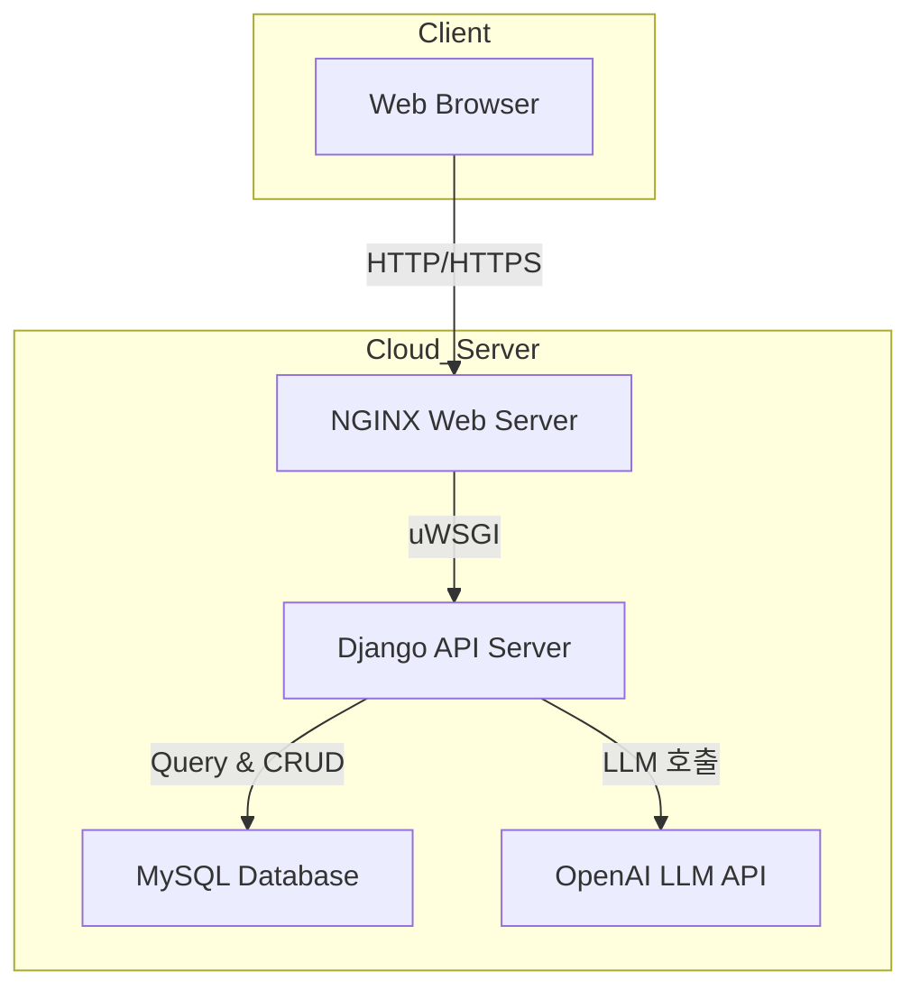

```mermaid
graph TD
    subgraph Client
        Browser[Web Browser]
    end
    subgraph Cloud_Server
        Web_Server[NGINX Web Server]
        Django_Server[Django API Server]
        MySQL[MySQL Database]
        LLM_API[OpenAI LLM API]
    end

    Browser -->|HTTP/HTTPS| Web_Server
    Web_Server -->|uWSGI| Django_Server
    Django_Server -->|Query & CRUD| MySQL
    Django_Server -->|LLM 호출| LLM_API    
```

