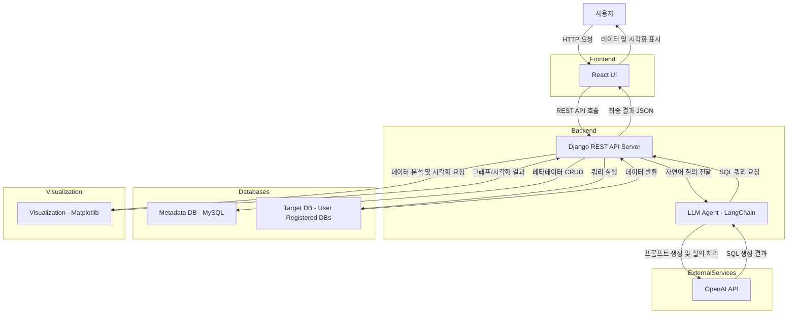

```mermaid
graph TD
    %% 사용자
    User[사용자]

    %% 프론트엔드
    subgraph Frontend
        ReactUI[React UI]
    end

    %% 백엔드
    subgraph Backend
        DjangoServer[Django REST API Server]
        LLM_Agent[LLM Agent - LangChain]
    end

    %% 데이터 저장소
    subgraph Databases
        MySQL[Metadata DB - MySQL]
        TargetDB[Target DB - User Registered DBs]
    end

    %% 시각화 도구
    subgraph Visualization
        Matplotlib[Visualization - Matplotlib]
    end

    %% 외부 서비스
    subgraph ExternalServices
        OpenAI_API[OpenAI API]
    end

    %% 흐름 정의
    User -->|HTTP 요청| ReactUI
    ReactUI -->|REST API 호출| DjangoServer
    DjangoServer -->|메타데이터 CRUD| MySQL
    DjangoServer -->|자연어 질의 전달| LLM_Agent
    LLM_Agent -->|프롬프트 생성 및 질의 처리| OpenAI_API
    OpenAI_API -->|SQL 생성 결과| LLM_Agent
    LLM_Agent -->|SQL 쿼리 요청| DjangoServer
    DjangoServer -->|쿼리 실행| TargetDB
    TargetDB -->|데이터 반환| DjangoServer
    DjangoServer -->|데이터 분석 및 시각화 요청| Matplotlib
    Matplotlib -->|그래프/시각화 결과| DjangoServer
    DjangoServer -->|최종 결과 JSON| ReactUI
    ReactUI -->|데이터 및 시각화 표시| User
```